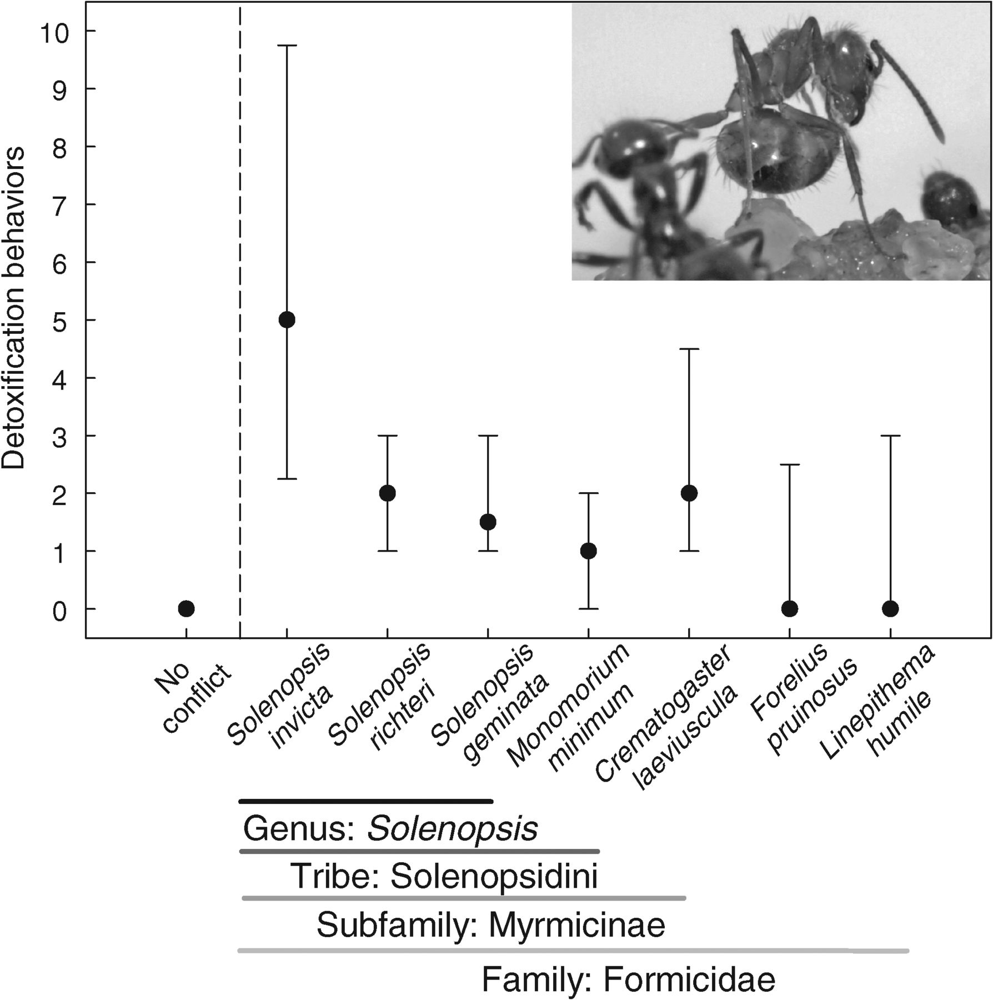
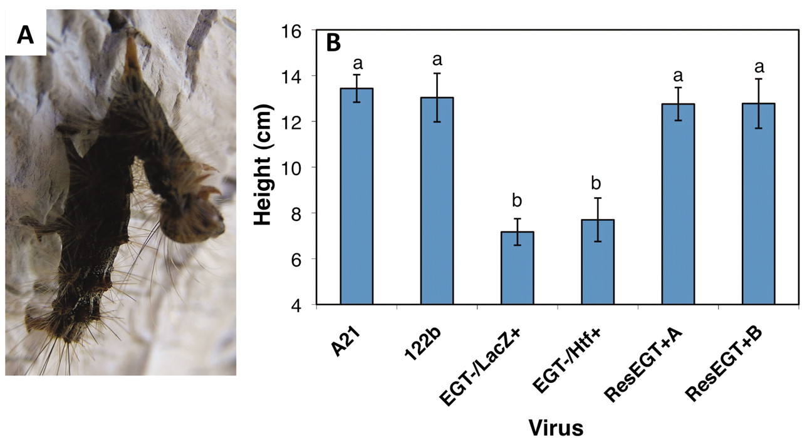
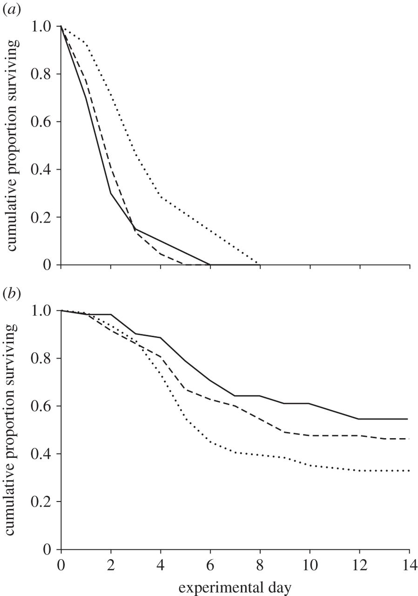

## Detoxifying ants
> **Reviews:** reading data, basic manipulations
> **New:** geom_pointrange
> **Difficulty:** Easy

LeBrun et al. (Science, 2014) showed that tawny crazy ants *Nylanderia fulva* can detoxify the venom from other ants. In their Figure 4, they show how strong is the detoxification behavior in *N. fulva* after chemical warfare with different species. Reproduce their plot (which is called a point-range plot) using `ggplot`

*The dependent variable is a 2-min count of N. fulva detoxification behaviors after chemical conflict with a variety of test species (x axis). Symbols indicate the median number of detoxification behaviors expressed. Error bars present interquartile ranges. The horizontal dashed line separates no conflict from post-interaction data. Interactions terminated when the test species deployed its defensive compounds against the N. fulva worker. Horizontal lines and text at bottom indicate species progressively less related to S. invicta. The inset image shows an N. fulva worker performing the detoxification behavior.*

1. Rename the columns for easier typing, and organize the data so that it is easy to plot
2. Use `geom_pointrange` to plot the figure
3. Make as pretty as you like

## Climbing gipsy moth
> **Reviews:** reading data, dplyr, barplots
> **New:** geom_errorbar, reordering factors, geom_text
> **Difficulty:** Easy/Medium

The defoliator insects Gypsy moths can be infected by a baculovirus that liquefies them. To maximize transmission, apparently the virus modifies the behavior of the host such that immediately before dying it tends to climb towards the top of the tree, so that virus will rain on the uninfected hosts.

We are going to plot the data of Hoover et al. (Science, 2011). In particular, we are going to replicate the boxplots in Figure 1 of their paper.

*A. Appearance of tree top disease in the gypsy moth. [Photo credit: V. Martemyanov, Novosibirsk, Russia] B. Influence of the egt gene on the height of L. dispar larvae when they died from infection by LdMNPV. Viruses contained the wild-type egt gene naturally (A21 and 122b) or by re-insertion (ResEGT+A and ResEGTB+) or had a functionally disrupted egt gene (EGT–/LacZ+ and EGT–/Htf+). Letters over the bars (±SE) represent means that are not significantly different from each other.*

1. Start with a basic barplot. You can try to obtain means and se using the summarise function of dplyr
2. Add the error bars
3. If you feel motivated, try to relabel the axis, and to rename the viruses
4. Explore a way to add the labels "a" and "b" on top of the graph, using `geom_text`

## Parasitic Fungi
> **Reviews:** reading data, dplyr, data manipulation, faceting
> **New:** linetype
> **Difficulty:** Medium/Hard

Reproduce Figure 2 of the recent Konrad et al., Proceedings of the Royal Society B, 2014. The figure represents survival of populations of ants (*Lasius neglectus*) exposed to a pathogen (*Metarhizium brunneum*). The populations of ants could be carrying a fungal ectosymbiont (*Laboulbenia formicarum*). This symbiont seems to have negative effects when ants are starved, but to add protection to populations facing the pathogen. Figure 2 is a simple plot with two treatments (starvation; pathogen exposure --- different panels), three levels of symbiont abundance (low; medium; high --- different lines). The y-axis represents survivorship, while the x-axis number of days.

You might find a better solution, but for me it took a lot of code to make the data into a format that can be easily plotted!

*Survival of Laboulbenia-carrying ants under resource restriction and Metarhizium exposure. (a) Under starvation     conditions, L. neglectus workers lived longer the lower the number of Laboulbenia formicarum thalli on their cuticles, whereas (b) after exposure with the entomopathogenic fungus M. brunneum, ants survived better the higher their thalli number. While statistics used the number of thalli as continuous predictor, visual representation separates survival curves of ants with low (1-75    thalli; dotted lines), medium (76-150 thalli; dashed lines) and high (more than 150 thalli; solid lines) levels of Laboulbenia.*

The trick here is to reformat the data and compute survival curves.